# Cómo solucionar problemas de cola alta de Proxy Zabbix

Por  Dmitry Lambert 15 de Octubre 2020

El proxy de Zabbix es un componente importante en toda la arquitectura de Zabbix. Como resultado, muy a menudo el fracaso de un proxy puede conducir a resultados dramáticos en toda la configuración de monitoreo causando una tormenta de eventos y problemas.

## Contenido

* Configuración
* ¿Por qué crece la cola?
  1. Mala configuración
  2. El proxy no puede conectarse al agente
  3. El proxy no puede conectarse al servidor
  4. El proxy no puede enviar datos lo suficientemente rápido (13:52)
  5. El proxy no tiene suficientes procesos
  6. El servidor no puede seguir el ritmo de los datos
  7. Demasiados valores sin enviar

En este post, se consideran los casos más comunes en la solución de problemas de proxy, lo que le dará una idea rápida de dónde debe buscar cuando algo va mal.

### Configuración

Configuración (instalado desde los paquetes):

* Zabbix 5.01
* CentOS 8
* Proxy Zabbix en la misma máquina con el servidor Zabbix
* El motor de base de datos MariaDB aloja la base de datos del servidor Zabbix y la base de datos del proxy Zabbix.
* Tres servidores Zabbix (duplicados) en **Configuration** > **Hosts**.
* "**Training proxy**" - proxy activo sin cifrado con compresión activada - añadido en **Administration** > **Proxies**.

En **Administration** > **Queue** los números crecen, pero teniendo en cuenta el número de elementos monitorizados, no se reciben datos de todos los elementos de mis hosts.

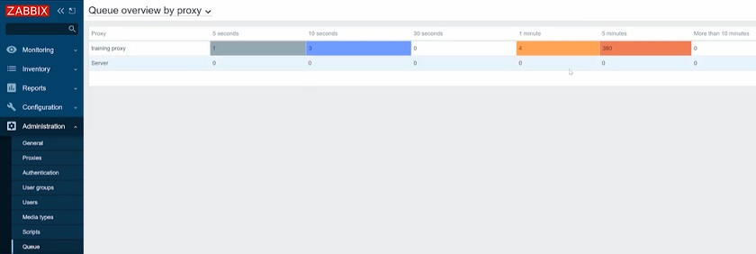

<center>Queue overview</center>

En la instancia de producción, esto también provocaría problemas. En este caso, todos los triggers con la función de disparo `nodata()` se dispararían y crearían muchos problemas.

### ¿Por qué crece la cola?

Zabbix Proxy monitoriza nuestros agentes Zabbix. Las comprobaciones y tipos de monitorización pueden ser tanto pasivas como activas. Los chequeos activos significan que los agentes se conectan al proxy para solicitar la configuración que contendrá información sobre qué datos deben ser recogidos. Recogen esos datos en el host y los pasan al proxy. Las comprobaciones pasivas de agentes funcionan de forma opuesta. El proxy se conecta a los agentes y sondea el valor que debe ser recogido. El proxy también puede trabajar en modo activo o pasivo, que también describe las mismas características de conexión.

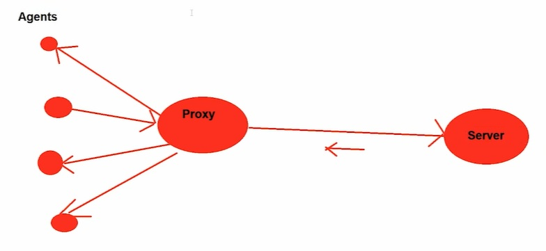

#### Mala configuración

Si tenemos un problema con el proxy, deberíamos comprobar los registros del proxy. Lo que significa que tendríamos que tener la posibilidad de SSH al servidor proxy.

```bash
tail -f /var/log/zabbix/zabbix_proxy.log
```


<center>Mensaje de spam 'no se pueden enviar datos proxy al servidor</center>

El mensaje de que los datos del proxy no se pueden enviar al servidor en la dirección IP localhost, porque el proxy "Proxy de formación" no se encuentra aparecerá sólo en un caso - cuando el parámetro de nombre de host en el archivo de configuración del proxy Zabbix no coincide con el nombre del proxy en el frontend Zabbix.

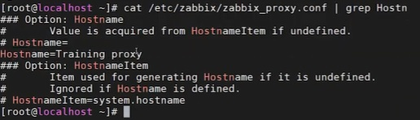

Mientras tenemos el 'Training proxy' funcionando, en el frontend, en **Administration** > **Proxies**, el 'training proxy' está especificado en minúsculas. Esto es suficiente para que el proxy deje de reportar los datos al servidor y comience a escribir estos errores en el log.

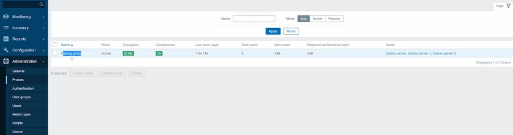

<center>Escritura diferente del nombre del proxy</center>

Por lo tanto, tenemos que cambiar el nombre del proxy y haga clic en **Update**.

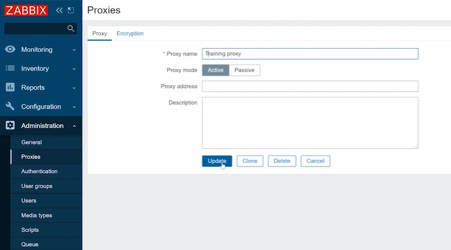

<center>Actualización del nombre del proxy</center>

Entonces, para ahorrarnos el tiempo de forzar la recarga de la caché de configuración en el Servidor Zabbix, puede ejecutar:

```bash
zabbix_server -R config_cache_reload
```

y luego comprueba los registros del proxy. Verás que el mensaje ha dejado de enviar spam. Tenga en cuenta que el servidor actualiza su caché de configuración automáticamente cada minuto por defecto.

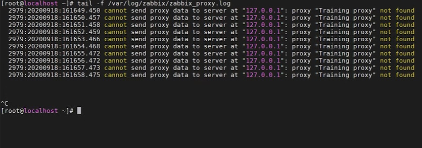

En **Administration** > **Queue** no se retrasa ningún valor y se procesan todos los datos.

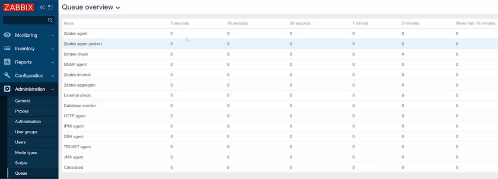

<center>Proxy queue overview</center>

Por lo tanto, en los casos de mala configuración, es necesario:
a) Comprobar el registro del proxy, que en la mayoría de los casos será suficiente, y
b) En casos excepcionales, compruebe el registro del servidor.

#### El proxy no puede conectarse al agente

Si el proxy no es capaz de obtener los datos de un agente, no tiene nada que ver con la comunicación proxy-servidor o con el propio servidor. Por lo tanto, tenemos que buscar alguna pista sobre el problema en los archivos de registro del proxy y del agente.

En primer lugar, comprueba el proxy. Lo más probable es que en los registros veas algunos

* network errors
* hosts unavailable
* connection timed out
* TCP connection problems
* O errores similares.

Por lo tanto, si hay un mensaje de error que indica que se ha perdido la conexión, por ejemplo, con el agente 1, pero todo lo demás funciona bien, lo más probable es que el problema esté en la red. Puede haber algún cambio en la red que impida al proxy obtener los datos del agente. Podemos ejecutar **zabbix_get** desde el proxy con la IP del agente, que estamos tratando de solucionar el problema, y alguna clave simple para probar la conectividad.

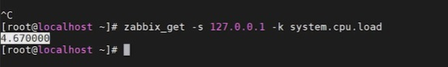

Si no hay problemas, el agente debería informar. Si el agente está informando pero en el frontend seguimos sin ver ningún dato, puede haber otros problemas, por ejemplo, si el proxy no tiene suficientes procesos responsables de este tipo de monitorización.

Puede que el agente simplemente se haya detenido, se haya bloqueado o se haya eliminado. En este caso, veríamos mensajes de error al ejecutar **zabbix_get**.

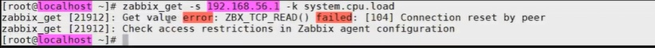

Si obtenemos este mensaje, el proxy no será capaz de obtener el valor, y el problema está en alguna parte con una conexión entre el proxy y el agente o con el propio agente. En este caso, necesitamos comprobar el host, que estamos monitorizando - si el agente se está ejecutando, o escuchando el puerto, o si hay algunas reglas de firewall que puedan estar bloqueando la conexión del proxy al agente. Quizás simplemente la dirección IP del Servidor en la configuración del agente difiere de la dirección IP del Proxy

Por lo tanto, si el proxy no puede conectarse al agente:

* Compruebe los registros del proxy
* Compruebe los registros de los agentes
* Aísle los agentes que no funcionan. Si todos los agentes no funcionan, entonces es un problema de red
* Usa **zabbix_get** o **snmpget** (problemas de snmp) para probar la conexión entre el proxy y el host.

#### El proxy no puede conectarse al servidor

Cuando el proxy no puede conectarse al servidor, es posible que no veamos nada en el registro del servidor, ya que la conexión está interrumpida y el servidor no recibirá ningún dato. Tenemos que comprobar los registros del proxy, donde veremos mensajes de error como "**cannot connect to server**" o "**cannot send proxy data to server**".

Si el proxy no puede conectarse al servidor, es necesario:

* Comprobar los registros del proxy.

#### El proxy no puede enviar datos lo suficientemente rápido

Si hay una cola del proxy pero algunos datos están pasando, el proxy es capaz de conectarse al servidor y a los agentes, a medida que los datos son recibidos y enviados, aunque con un retraso. Esto significa que el proxy no puede seguir el flujo de datos, y los datos en el proxy se acumulan más rápido de lo que se envían. Puedes ver el problema en **Latest data**, donde los gráficos tendrán huecos y puntos.

Para comprobar el problema, debe ejecutar **ps ax | grep sender en el host Proxy de Zabbix**.

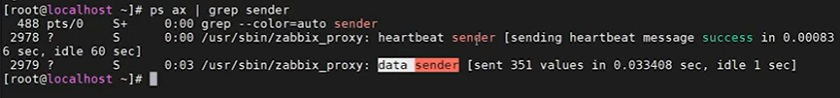

Sólo hay un proceso - remitente de datos en el proxy Zabbix, que no existe en el servidor y que es el único proceso responsable de enviar datos al servidor. Aquí, estamos interesados en las líneas que describen el remitente. Si ejecutamos el comando varias veces, las líneas que describen el remitente irán cambiando.

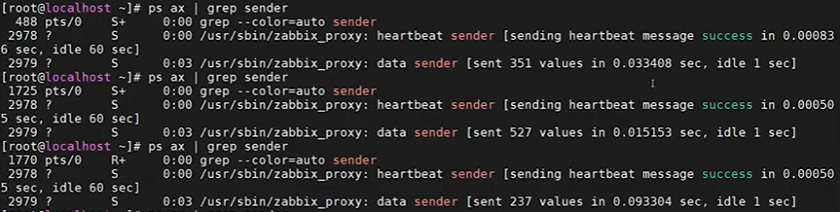

El problema existe, si vemos que el número de valores enviados por segundo no es suficiente. Una iteración del remitente de datos tarda cientos de segundos o incluso más.  En este caso, podemos abrir la base de datos y ejecutar la consulta:

```bash
select max(id)-(select nextid from ids where table_name + "proxy_history" limit l) from proxy_history;
```

Esta consulta nos dirá cuántos valores quedan en la base de datos del proxy que aún no se han enviado al servidor Zabbix. Básicamente, se trata de una cola de backlog en el proxy.

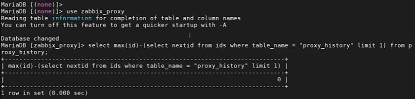

En el ejemplo anterior, todo funciona bien, la cola no se acumula.

Si observamos que el emisor de datos tarda cientos de segundos en enviar los valores al servidor, lo más probable es que el resultado de la consulta no sea cero. Y si se ejecuta la consulta varias veces, se verá que la acumulación en el proxy no hace más que aumentar.

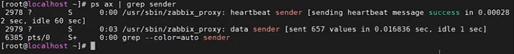

Estos problemas pueden deberse a varias razones, una de ellas es una conexión de red lenta entre el proxy Zabbix y el servidor Zabbix. En este caso, el ping no suele ser suficiente para saber si la red es buena o mala. Si todos los procesos no están ocupados, pero el emisor de datos está luchando para enviar los datos, entonces probablemente debería consultar a su equipo de redes. También podría ser un problema en el lado del servidor Zabbix. El remitente de datos es el único proceso que está enviando datos al servidor, pero en el lado del servidor sólo los Trappers son responsables de aceptar esos datos. Así que asegúrese de que tiene suficientes trappers en el servidor y que no están 100% ocupados.

Por lo tanto, si el proxy no puede enviar datos lo suficientemente rápido, es necesario:

* Comprobación de los datos del remitente
* Comprobar la cola en la base de datos proxy
* Compruebe la velocidad de conexión a la red

#### El proxy no tiene suficientes procesos

Supongamos que tenemos un servidor Zabbix en funcionamiento, Zabbix frontend, y la mayor parte del medio ambiente se controla a través del servidor Zabbix.

En Administration > **Proxies** vemos que nuestro proxy de formación sólo tiene tres hosts añadidos.


Estos tres hosts están recibiendo datos, no hay cola y no falta ningún dato. Supongamos que en un mes necesitamos desplegar un descubrimiento de red o un registro de agente activo en el proxy y añadir más hosts a monitorizar. Podríamos llegar a unos 30.000 hosts cuando veamos los problemas: lagunas o aumento de la cola en los proxies.

Si comprobamos el registro del servidor, puede que no haya nada malo en él: ni problemas, ni consultas lentas. También podemos **Monitoring** > **Hosts** y mostrar, por ejemplo el gráfico **internal process busy**

Entonces el problema puede estar en el proxy. Como hemos añadido 30.000 hosts nuevos, el número de procesos en el proxy podría no ser suficiente para la cantidad actual de datos que pasan por el proxy.

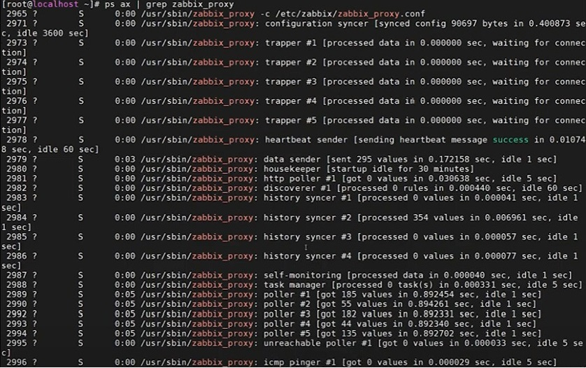

<center>Procesos que se ejecutan en el proxy</center>

Así, cuando desplegamos 30.000 hosts, la cantidad de procesos que teníamos anteriormente no es suficiente para la configuración actual. Este problema no se mostrará en los registros del servidor o en el gráfico del servidor. En este caso, necesitamos monitorizar el proxy. Para ello, vaya a **Configuration** > **Hosts**, crear un host, añadirlo al grupo, especificar que el host es supervisado por el proxy, y el propio proxy. Haga clic en **Add**.

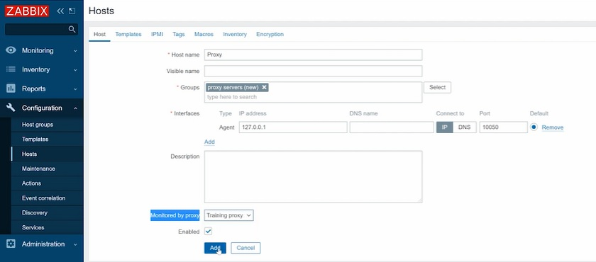

<center>Añadir host</center>
**NOTA**. Los usuarios suelen especificar la interfaz del agente con la dirección externa del proxy, lo que no es exactamente correcto.

Supervisará el proxy con la función template **Template App Zabbix Proxy** en **Configuration** > **Templates**. Este proxy tiene elementos internos que no utilizan la dirección IP especificada en la interfaz del agente Zabbix.

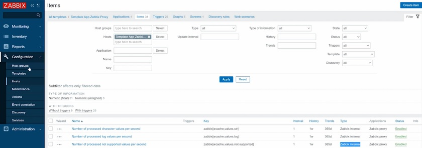

<center>Items internos del proxy</center>

Si no va a configurar este host para que sea supervisado por el propio proxy en **Configuration** > **Hosts** seguirá viendo los datos en esos gráficos de rendimiento, pero esos datos provendrán del servidor Zabbix, y podría ser engañado mediante los gráficos **Monitoring** > **Hosts**, procesos de recopilación de datos y procesos internos. Así, usted vería realmente los datos del servidor, que podría no estar ocupado, mientras que el proxy podría estar luchando. En este caso, todo lo que necesitas es añadir más procesos como **pollers**, **trappers**, **etc**.

Si el proxy no tiene suficientes procesos, debes asegurarte de monitorizarlo correctamente y comprobar los gráficos de rendimiento del proxy:

* Procesos de recopilación de datos ocupados.
* Procesos internos ocupados.
* Porcentaje de caché libre.

#### El servidor no puede seguir el ritmo de los datos

Si los datos son extraídos de los agentes por el proxy, que luego los empuja al servidor, puede haber problemas en el servidor. Podremos darnos cuenta de esto en los logs del servidor donde lo más probable es que veamos algunas consultas lentas o tiempos de espera. Más importante aún, veremos la misma información en los gráficos de rendimiento en **Monitoring** > Hosts.

Aquí tenemos que comprobar, por ejemplo **data gathering process busy**

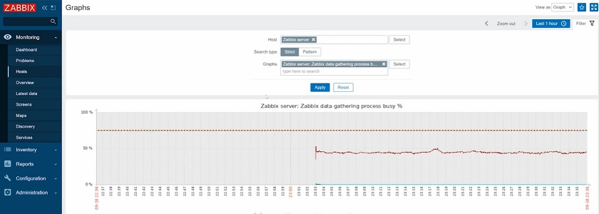

<center><b>data gathering process busy</b> performance graphs</center>

Más concretamente, nos interesan los trappers, ya que sólo los trappers operan con los proxies activos que estamos considerando en este ejemplo.

Por lo tanto, si los trappers están completamente ocupados, lo más probable es que lo único que tengas que hacer sea simplemente aumentar el número de trappers.

Si los trappers están ocupados, pero en el gráfico 'Zabbix internal process busy %' vemos que housekeeper, history sinker, y básicamente la mayoría de los gráficos están funcionando con una carga del 100%, y hay algunos puntos y huecos en el gráfico, esto significa que tienes serios problemas de rendimiento con el servidor Zabbix. En el 99% de los casos, esto será causado por problemas de rendimiento de base de datos y el problema con la configuración de Zabbix.

#### Demasiados valores sin enviar

A veces, cualquiera de los problemas anteriores puede hacer que el proxy recoja un backlog cuando la cola no cae o cae con extrema lentitud una vez solucionado el problema. En este caso, podemos ejecutar la consulta para comprobar la acumulación en la base de datos del proxy.

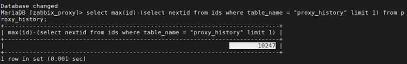

Si ves, por ejemplo, millones de valores, entonces el proxy no está funcionando durante algún tiempo, tiene una enorme acumulación en la base de datos, y la cola sigue acumulándose. En este caso, lo único que podemos hacer es eliminar el backlog - borrar todos los datos almacenados en la base de datos del proxy y empezar de cero. Perderemos el historial de datos no enviados de ese periodo, pero al menos volverá a monitorizarse.

Para ello, necesitamos:

1. Detenga el proxy Zabbix

   ```bash
   systemctl stop zabbix-proxy
   ```
2. Abrir la base de datos

   ```bash
   mysql
   ```
3. Vaciar completamente dos  tablas

   ```bash
   truncate proxy_history;
   ```

   ```bash
   truncate ids;
   ```
4. Salga de la base de datos e inicie el proxy Zabbix

   ```bash
   systemctl start zabbix-proxy
   ```

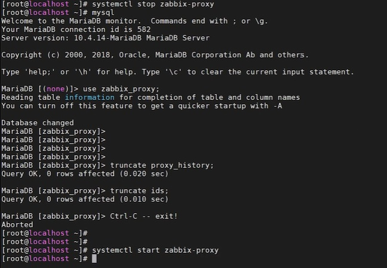

5. Recargar

   ```bash
   zabbix_server -R config_cache_reload
   ```
6. Abrir la Base de Datos

   ```bash
   mysql
   ```
7. Entrar en la Base de Datos del Zabbix Proxy

   ```bash
   use zabbix-proxy;
   ```

   y en la consulta, no verá ningún retraso.

    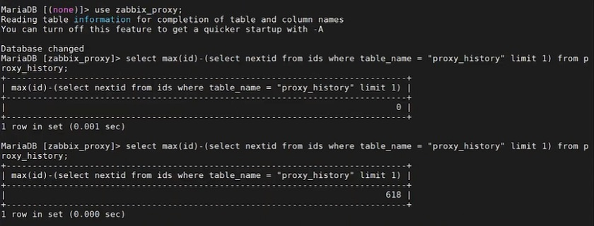

    Proxy backlog dropped

**NOTA**. No olvide truncar la tabla de IDs. Si trunca sólo las tablas de historial de proxy, nada va a funcionar.

Por lo tanto, si hay demasiados valores sin enviar y la cola de proxy se está acumulando, es necesario eliminar el retraso.